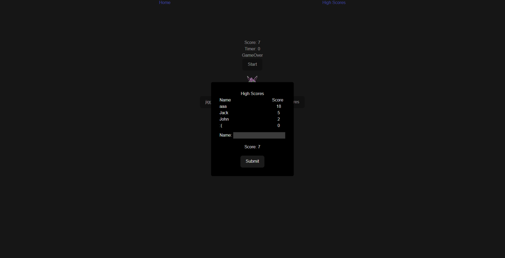

# pokemonHighScoreServer

## Preview

### Desktop
#### Home Page

## Description of project (spec / MVP)

### MVP:
  - Create a spring API that will have atleast one get and post route.
  - The get route will return all enteries in the database sorted form highest to lowest.
  - The post route will allow the user to passing an object with name and score properities and post it to the database.

## Approach

* After I download the spring initial package.
* I Creatd the Entity which is basically the information that will be stored in MySQL database.
* The DTO which is data transfer object is created next where it will be what the user will input at the route in this case it is an object which has a name and score property.
* The Controller was created next where the routes are mapped out.
* An repository Interface is created where it extends JpaRepository this allows service once it implements the interface to have access to methods that basically query MySQL.
* The Service was created after this which is where the logic that will happen in the controller. E.g. For post methods creating an instance of the Entity from the DTO passed and saving it to the database.
* In the service a dependecy injection occurs to inject an instance of the earlier created repository so the service has access to the MySQL query methods.
* As the controller calls the service methods another dependcy injection is made of an instance of the service class so the Controller can call service methods created.

## Reflection
* What are you proud of? 
  - This was my first time building a spring api on my own. I am proud that my understanding of a fullstack application linking frontend to a backend and how they interact using crud api methods has developed through building this project.
* What was a challenge?
  - I came across and issue where CORS was stopping me from posting data. With some research I found in the controller file on each route annotating @CrossOrigin will allow me to locally use the api route.
* What you'd do differently?
  - Create more routes possible for a delete method which can clear the highscore database.

## Future Goals

* Add more routes such as a delete route
* Create user system where login/sign is done instead of inputing name when subbmiting score

## Further reading or links to inspiration

*  [Spring Annotations]( https://www.techferry.com/articles/spring-annotations.html)
*  [Spring Initializr]( https://start.spring.io/)
*  [How to Build a Spring Boot REST API with Java]( https://hevodata.com/learn/spring-boot-rest-api/)

## Stay in touch

*  [Portfolio]( https://edric-khoo.vercel.app/)
*  [Linkedin]( https://www.linkedin.com/in/edric-khoo-98881b173/)

